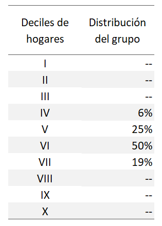

```{r setup, include=FALSE}
knitr::opts_chunk$set(echo = FALSE)
library(downloader)
```

## Medidas de posición

Dividen el conjunto de datos en partes iguales.

- **Cuartiles:** divide los datos en cuatro partes iguales, mediante la estimación de tres cuartiles: Q1 = 25%; Q2 = 50%; Q3 = 75%
- **Deciles:** divide a los datos en 10 partes iguales, mediante la estimación de 9 deciles, de D1 a D9.
- **Percentiles:** divide los datos en 100 partes iguales, calculando los percentiles P1 a P99.

## Medidas de posición: cuartiles

Para estimar la posición, se debe aplicar la siguiente fórmula:

<div class="centered">
$Q_1 = \frac{(n+1)}{4}$;

$Q_2 = \frac{2(n+1)}{4}$;

$Q_3 = \frac{3(n+1)}{4}$
</div>

Donde:

* $Q_1,_2,_3$ : Cuartil (1, 2 y 3)
* n : Total de datos.


## Medidas de posición: cuartiles

Para la información de alturas de los integrantes del grupo, calcular:

$Q_1$;  

$Q_2$;  

$Q_3$  


## Medidas de posición: deciles

Para estimar la posición, se debe aplicar la siguiente fórmula:

<div class="centered">
$D_1 = \frac{(n+1)}{10}$;

$D_5 = \frac{5(n+1)}{10}$;

$D_9 = \frac{9(n+1)}{10}$
</div>

Donde:

* $D_1,..,_9$ : Decil 1 a 9.
* n : Total de datos.


## Medidas de posición: deciles

Para la información de alturas de los integrantes del grupo, calcular:

$D_1$;  

$D_5$;  

$D_9$  


## Medidas de posición: pecentiles

Para estimar la posición, se debe aplicar la siguiente fórmula:

<div class="centered">
$P_1 = \frac{(n+1)}{100}$;

$P_{50} = \frac{50(n+1)}{100}$;

$P_{99} = \frac{99(n+1)}{100}$
</div>

Donde:

* $P_{1,..,99}$ : Decil 1 a 9.
* n : Total de datos.


## Medidas de posición: percentiles

Para la información de alturas de los integrantes del grupo, calcular:

$P_{10}$;  

$P_{50}$;  

$P_{75}$  


## Medidas de posición: en la práctica

Piensa en los ingresos mensuales de tu hogar, ¿en qué decil de ingreso crees que se encuentre tu familia?

<div class="centered">

</div>


## Medidas de posición: en la práctica
### Deciles de ingreso en México 2020

<div class="centered">

</div>


## Medidas de posición: mediana

La **MEDIANA** es el valor central de todos los datos cuando se encuentran ordenados de mayor a menor valor.

La mediana es:
<div class="centered">

$Q_2 = D_5 = P_{50}$;
</div>

## Medidas de posición en R

Importar archivos de internet
```{r, echo = TRUE}

url <- "https://github.com/cjjmdata/curso_analisis_de_datos_I/blob/main/Datos/grupo_edad_altura.csv"
filename <- "datos_grupo.csv"
download(url, destfile=filename)
data_gpo <- read.csv(filename)
```


```{r, echo=TRUE}
?quantile
```


## Medidas de tendencia central

Su objetivo es resumir en un único valor un conjunto de valores.

Se ubican hacia el centro de la distribución de los valores de la serie de datos.

- Mediana
- Moda
- Media


## Medidas de tendencia central: mediana

La **MEDIANA** es el **valor central** de todos los datos cuando se encuentran ordenados de mayor a menor valor.

Es tanto una medida de posición como de tendencia central.


## Medidas de tendencia central: moda

La **MODA** es el valor que **más se repite** en un conjunto de datos.


## Medidas de tendencia central: media

La **MEDIA** es una de las medidas de tendencia central más utilizadas, sin embargo, existen varias "medias":

- Media aritmética (simple).
- Media ponderada.
- Media geométrica.
- Media armónica.

## Medidas de tendencia central: media aritmética

La **MEDIA ARITMÉTICA** simple (o promedio simple) identifica el valor central de un conjunto de datos.

<div class="centered">
$\overline{x} = \frac{\displaystyle\sum_{i=1}^n x_i }{n}$
</div>

Donde:

- $x_1, x_2,..., x_n$ es un conjunto numérico de datos.
- n: número total de casos.  

Importante: es afectada por los valores extremos de la distribución (grandes o pequeños)


## Medidas de tendencia central: media ponderada

La **MEDIA PONDERADA** se utiliza cuando cada registro (dato) tiene una importancia relativa distinta; considera ponderadores para asignar dichos pesos.

<div class="centered">
$\overline{x}_w = \frac{\displaystyle\sum_{i=1}^n x_i * w_i}{\displaystyle\sum_{i=1}^n w_i}$
</div>

Donde:

- n: número total de casos.
- $x_1, x_2,..., x_n$ es un conjunto numérico de datos.
- $w_1, w_2,..., w_n$ es el peso correspondiente a cada $x_i$.


## Medidas de tendencia central: media geométrica

La **MEDIA GEOMÉTRICA** de un conjunto de datos se define como la enésima raíz del producto de n números.

<div class="centered">
  $\overline{x} = \sqrt[n]{x_1 *x_2*...*x_n} = (\displaystyle\prod_{i=1}^n x_i)^{1/n}$
</div>

Se utiliza particularmente para progresiones geométricas, razones, interés compuesto y números índices.

IMPORTANTE: solo se puede aplicar a números positivos. Los valores extremos tienen menor influencia que en la media aritmética.


## Medidas de tendencia central: media armónica

La **MEDIA ARMÓNICA** es el recíproco de la media aritmética de los recíprocos de los datos:  

<div class="centered">
  $H = \frac{n}{\displaystyle\sum_{i=1}^n\frac{1}{x_i} } = \frac{n}{\frac{1}{x_1}+\frac{1}{x_2}+...+\frac{1}{x_n}}$
</div>

Es poco sensible a valores grandes pero muy sensible a valores próximos a ceros.

Se recomienda para promediar velocidades (variaciones respecto al tiempo).

IMPORTANTE: solo se puede aplicar a números positivos.

## Medidas de tendencia central: media armónica

Ejemplo **MEDIA ARMÓNICA**:

Una familia realizó un viaje por carretera a Huatulco, registrando las siguientes velocidades:


  - Los primeros 50 km a 90 km/h.
  - Los segundos 50 km a 70 km/h.
  - Los siguientes 50 km a 45 km/h.
  - Los siguientes 50 km a 40 km/h.
  - Los últimos 50 km a 50 km/h.


Calcular la velocidad media del viaje.

¿Cuánto tiempo duró el viaje?


