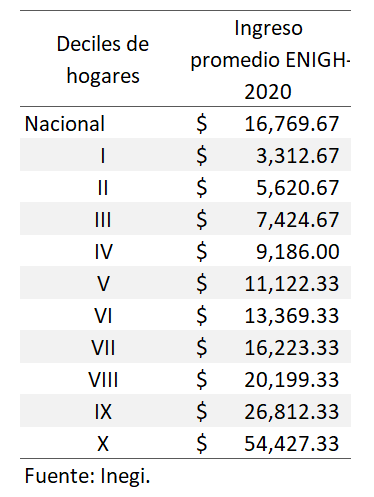

```{r setup, include=FALSE}
knitr::opts_chunk$set(echo = FALSE)
library(downloader)
```

## Medidas de posición

Dividen el conjunto de datos en partes iguales.

- **Cuartiles:** divide los datos en cuatro partes iguales, mediante la estimación de tres cuartiles: Q1 = 25%; Q2 = 50%; Q3 = 75%
- **Deciles:** divide a los datos en 10 partes iguales, mediante la estimación de 9 deciles, de D1 a D9.
- **Percentiles:** divide los datos en 100 partes iguales, calculando los percentiles P1 a P99.

## Medidas de posición: cuartiles

Para estimar la posición, se debe aplicar la siguiente fórmula:

<div class="centered">
$Q_1 = \frac{(n+1)}{4}$;

$Q_2 = \frac{2(n+1)}{4}$;

$Q_3 = \frac{3(n+1)}{4}$
</div>

Donde:

* $Q_1,_2,_3$ : Cuartil (1, 2 y 3)
* n : Total de datos.


## Medidas de posición: cuartiles

Para la información de alturas de los integrantes del grupo, calcular:

$Q_1$;  

$Q_2$;  

$Q_3$  


## Medidas de posición: deciles

Para estimar la posición, se debe aplicar la siguiente fórmula:

<div class="centered">
$D_1 = \frac{(n+1)}{10}$;

$D_5 = \frac{5(n+1)}{10}$;

$D_9 = \frac{9(n+1)}{10}$
</div>

Donde:

* $D_1,..,_9$ : Decil 1 a 9.
* n : Total de datos.


## Medidas de posición: deciles

Para la información de alturas de los integrantes del grupo, calcular:

$D_1$;  

$D_5$;  

$D_9$  


## Medidas de posición: pecentiles

Para estimar la posición, se debe aplicar la siguiente fórmula:

<div class="centered">
$P_1 = \frac{(n+1)}{100}$;

$P_{50} = \frac{50(n+1)}{100}$;

$P_{99} = \frac{99(n+1)}{100}$
</div>

Donde:

* $P_{1,..,99}$ : Decil 1 a 9.
* n : Total de datos.


## Medidas de posición: percentiles

Para la información de alturas de los integrantes del grupo, calcular:

$P_{10}$;  

$P_{50}$;  

$P_{75}$  


## Medidas de posición: en la práctica

Piensa en los ingresos mensuales de tu hogar.

¿En que decil de ingreso crees que se encuentre tu familia?

## Medidas de posición: en la práctica
### Deciles de ingreso en México 2020

<div class="centered">

</div>


## Medidas de posición: mediana

La **MEDIANA** es el valor central de todos los datos cuando se encuentran ordenados de mayor a menor valor.

La mediana es:
<div class="centered">

$Q_2 = D_5 = P_{50}$;
</div>

## Medidas de posición en R

Importar archivos de internet
```{r, echo = TRUE}

url <- "https://github.com/cjjmdata/curso_analisis_de_datos_I/blob/main/Datos/grupo_edad_altura.csv"
filename <- "datos_grupo.csv"
download(url, destfile=filename)
data_gpo <- read.csv(filename)
```


```{r, echo=TRUE}
?quantile
```


## Medidas de tendencia central

Su objetivo es resumir en un único valor un conjunto de valores.

Se ubican hacia el centro de la distribución de los valores de la serie de datos.

- Mediana
- Moda
- Media


## Medidas de tendencia central: mediana

La **MEDIANA** es el valor central de todos los datos cuando se encuentran ordenados de mayor a menor valor.

Es tanto una medida de posición como de tendencia central.


