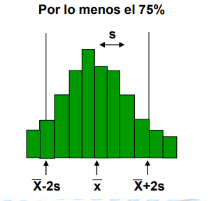
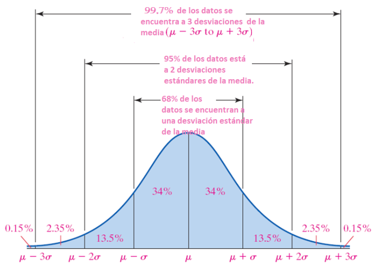

```{r setup, include=FALSE}
knitr::opts_chunk$set(echo = FALSE)
library(downloader)
library(modeest)
library(PearsonDS)
```


## Medidas de forma

Se utilizan para describir dos características de la distribución de los datos:

- Simetría (o asímetria): miden la mayor o menor simetría (mayor o menor asimetría) de la distribución de los datos.
- Curtosis: miden la mayor o menor concentración de los datos alrededor de la media.

## Distribución simétrica

- Hay el mismo número de elementos a la izquierda y derecha de la media.
- La media, mediana y moda coinciden.
- 'Forma de campana' (distribución normal)

```{r, echo = FALSE}

a <- rbeta(10000,5,5)
hist(a, main='Distribución simétrica', xlab = "")
abline(v = mean(a), col='red', lwd = 5)
abline(v = median(a), col='blue', lwd = 2)
abline(v = betaMode(5,5), col='yellow', lwd = 1)
legend("topright", legend = c("Media", "Mediana", "Moda"),
       lwd = 1, col = c("red", "blue","yellow"))
```


## Distribución asimétrica a la izquierda / negativa

- La cola izquierda de la distribución se alarga para los valores por debajo de la media.

```{r, echo = FALSE}

b <- rbeta(10000,5,2)
hist(b, main='Distribución simétrica', xlab = "Datos")
abline(v = mean(b), col='red')
abline(v = median(b), col='blue')
abline(v = betaMode(5,2), col='yellow')
legend("topleft", legend = c("Media", "Mediana", "Moda"),
       lwd = 1, col = c("red", "blue","yellow"))
```

## Distribución asimétrica a la derecha / positiva

- La cola derecha de la distribución se alarga para los valores por encima de la media.

```{r, echo = FALSE}

c <- rbeta(10000,2,5)
hist(c, main='Distribución simétrica', xlab = "Datos")
abline(v = mean(c), col='red')
abline(v = median(c), col='blue')
abline(v = betaMode(2,5), col='yellow')
legend("topright", legend = c("Media", "Mediana", "Moda"),
       lwd = 1, col = c("red", "blue","yellow"))
legend("topright", legend = c("Media", "Mediana", "Moda"),
       lwd = 1, col = c("red", "blue","yellow"))
```


## Coeficiente de asimetría de Fisher

<div class="centered">
$g_1 = \frac{\frac{1}{n}\displaystyle\sum(x_i - \overline{x})^3 * n_i }{(\frac{1}{n}\displaystyle\sum(x_i - \overline{x})^3 * n_i)^{3/2}}$
</div>

Donde:  
$g_1:$ coeficiente de asimetría de Fisher.  
$\overline{x}:$ media de los datos.  
$n_i:$ frecuencia de cada valor.  
  

$g_1 = 0:$ Distribución simétrica.  
$g_1 < 0:$ Asimétrica negativa.  
$g_1 > 0:$ Asimétrica positiva.  


## Kurtosis

Estima el grado de concentración de los datos alrededor de la zona central de la distribución.

<div class="centered">

</div>

Leptocúrtica: gran concentración de valores alrededor de la media.  
Mesocúrtica: concentración 'normal' de valores alrededor de la media.  
Platicúrtica: baja concentración de valores alrededor de la media.


## Coeficiente de curtosis

<div class="centered">
$g_2 = \frac{\frac{1}{n}\displaystyle\sum(x_i - \overline{x})^4 * n_i }{(\frac{1}{n}\displaystyle\sum(x_i - \overline{x})^2 * n_i)^2} - 3$
</div>

Donde:  
$g_2:$ coeficiente de curtosis.  
$\overline{x}:$ media de los datos.  
$n_i:$ frecuencia de cada valor.  
  

$g_2 = 0:$ distribución mesocúrtica.  
$g_2 > 0:$ distribución leptocúrtica.  
$g_2 < 0:$ distribución platicúrtica.


## Teorema de Chebyshev

Dado un número *k* mayor o igual a 1 y un conjunto de *n* mediciones, al menos $1-(\frac{1}{k^2})$ de las mediciones estarán dentro de *k* desviaciones estándar de su media.

<div class="centered">

</div>
  
  
Teorema: proposición matemática demostrable a partir de axiomas o de proposiciones ya demostradas.

Chebyshev: matemático ruso (1821 - 1894).

## Teorema de Chebyshev: ejemplo

Interjet tiene estimado que en promedio, en cada vuelo transporta 53.82 pasajeros, con una desviación estándar de 10.18.

¿Qué porcentaje de los vuelos de interjet están dentro de *k=2* desviaciones estándar de la media y cuál es dicho  intervalo de pasajeros?

1. Calcular los límites del intervalo para +/- dos desviaciones estándar.
2. Aplicar la fórmula del teorema de Chebyshev.


## Regla empírica

Para distribuciones normales, tenemos la siguiente regla empírica:

<div class="centered">

</div>


