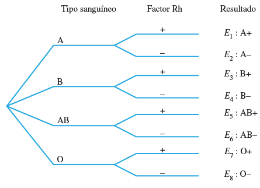
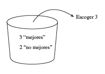
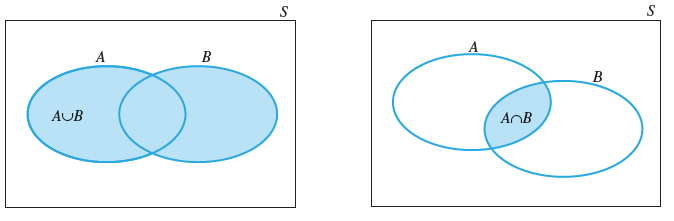
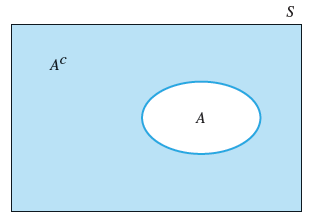

```{r setup, include=FALSE}
knitr::opts_chunk$set(echo = FALSE)
library(downloader)
#library(eulerr)
```


## Probabilidad en estadística

La probabilidad puede ser utilizada de dos maneras:

1. Población conocida: para describir la probabilidad de observar un resultado muestral en particular $\Longrightarrow$ sacar aguila en un volado
1. Población desconocida: para hacer enunciados sobre la composición de la población a partir de una muestra $\Longrightarrow$ inferencia estadística


## Proceso aleatorio

En un **proceso aleatorio** sabemos los resultados que pueden ocurrir, pero desconocemos cuál ocurrirá en particular.

- Lanzar una moneda
- Lanzar un dado
- Spotify: reproducción aleatoria
- Mercado accionario (se modela como aleatorio, aunque no lo sea específicamente)

## Eventos y el espacio muestral

**Experimento**: proceso mediante el cual se obtiene una observación (medición).

Ejemplos:

* Entrevistar a un habitante regular de una vivienda para saber si recibe remesas.
* Medir la concentración de $CO_2$ en diversos puntos de la ciudad.
* Probar una microprocesador para determinar si es un producto defectuoso o aceptable.
* Lanzar una moneda.
* Lanzar un dado.


## Eventos y el espacio muestral

**Evento simple**: es el resultado que se observa en una sola repetición del experimento.

Experimento:  
Lanzar un dado y registrar el número que aparecer en la cara superior.

Ejercicio: determine la lista de los eventos simples del experimento.

Eventos $E_1, E_2,..., E_6$

## Eventos simples

Solución.

Cuando se lanza un dado, hay seis posibles resultados. Los eventos simples son:

<div class="columns-2">

Evento $E_1$: observar un 1

Evento $E_2$: observar un 2

Evento $E_3$: observar un 3

Evento $E_4$: observar un 4

Evento $E_5$: observar un 5

Evento $E_6$: observar un 6

</div>


## Eventos

**Evento**: subconjunto de eventos sencillos, denotado por una letra mayúscula

Podemos definir los eventos A y B para el experimento de lanzar al aire un dado:

A: observar un número impar.

B: observar un número menor a 4.

<div class="columns-2">
A = {$E_1, E_3, E_5$}

B = {$E_1, E_2, E_3$}

$\Longrightarrow$ conjunto de 3 eventos sencillos

$\Longrightarrow$ conjunto de 3 eventos sencillos

</div>


## Cálculo de probabilidades de eventos

La probabilidad de un evento A es una medida de nuestra creencia de que el evento A ocurrirá.

$P(A) =$ Probabilidad del Evento A


<div class="columns-2">
Interpretación frecuentista:

La probabilidad de un resultado es la proporción de veces que el resultado ocurrirá si observáramos el proceso aleatorio un número $\infty$ de veces.

Interpretación Bayesiana:

La probabilidad es un grado de creencia subjetiva. Permite que información a priori (previa) se integre en el marco inferencial.

</div>

## Cálculo de probabilidades de eventos


Frecuentista

Si un experimento se realiza *n* veces, entonces la frecuencia relativa de un proceso particular, por ejemplo A, es:

Frecuencia relativa = $\frac{Frecuencia}{n}$

Donde Frecuencia: es el número de veces que ocurrió el evento A.

## Cálculo de probabilidades de eventos

Si hacemos que el número ***n*** de repeticiones del experimento se haga cada vez más grande ($n \rightarrow \infty$), en último caso se genera toda la población y la probabilidad del evento A se define como:

$P(A) = \lim_{n \to \infty} \frac{Frecuencia}{n}$

Como P(A) se comporta como una frecuencia relativa, entonces:

$0 \leqslant P(A) \leqslant 1$


## Ley de los grandes números

La ley de los grandes números establece que, a un mayor número de observaciones que se obtengan, la proporción de repeticiones con un resultado particular, convergerá a la probabilidad de ese resultado.

Ejercicio:

Simular el lanzamiento de una dado 5 mil veces.

<div class="centered">
Abre Excel
</div>


## Pregunta de repaso

¿Cuál de los siguientes eventos podría ser más sorpredente:

1. Obtener exactamente 3 aguilas en 10 volados
1. Obtener exactamente 3 aguilas en 100 volados
1. Obtener exactamente 3 aguilas en 1000 volados


## Pregunta

Supongamos que lanzas una moneda 10 veces y en todas las ocasiones cae ***sol***.

<div class="centered">
H H H H H H H H H H
</div>


¿Cuál pensarías que sea la probabilidad de que aparezca otro sol en el siguiente lanzamiento?

* 0.5
* Menos de 0.5
* Más de 0.5


## La moneda no tiene memoria

La probabilidad sigue siendo de 50%

P(H en el 11vo lanzamiento) = P(H en el 10o lanzamiento) = 0.5

<div class="centered">
Cada lanzamiento es INDEPENDIENTE, por lo que el resultado del siguiente lanzamiento no depende del lanzamiento previo.
</div>

## Falacia del apostador

La ley de los promedios

"Los procesos aleatorios debería compensar lo que haya ocurrido en el pasado"

CUIDADO: esto es un MALENTENDIDO de la Ley de los Grandes Números.


## Disjuntos (disjoint)

Eventos **mutuamente excluyentes** no pueden pasar al mismo tiempo:


* El resultado de lanzar un dado no pueden ser dos números distintos.
* Una carta extraída de un maso no puede ser as y reina a la vez.
* Un 'volado' no puede caer águila y sol al mismo tiempo.


$P(A$ y $B) = 0$


## Eventos no disjuntos

Eventos que no son mutuamente excluyentes pueden pasar al mismo tiempo.

$\rightarrow$ que llueva y haga frío.


$P(A$ y $B) \neq 0$


## Eventos disjuntos: ejemplos

1. Los eventos:

* A: observar un número impar.
* B: observar un número menor a 4.

¿Son mutuamente excluyentes o no?


2. Los eventos simples E_1, E_2,..., E_6, ¿Son mutuamente excluyentes o no?


## Espacio muestral

El **espacio muestral S**:

* Es una lista (**conjunto**) de todos los posibles resultados.
* La lista tiene que ser:
    * Mutuamente excluyente
    * Colectivamente exhaustiva (no importa lo que pase en el experimento, siempre se obtendrá uno de los resultados del espacio muestral)
* Arte: determinar la granularidad correcta (los modelos son bastracciones de la realidad y dejan cosas por fuera)


## Ejercicios

Ejercicios:

1. Determine el **espacio muestral** para el experimento de lanzar una moneda.
2. Determine el **espacio muestral** para el experimento de registrar el tipo de sangre de una persona.
3. Una pareja tiene dos hijos, determine el espacio muestral del género de estos niños. Por simplicidad ,asumiremos que el género puede ser femenino y masculino.
3. Dibuje el **diagrama de Venn** para el tiro de un dado.


## Diagrama de árbol

Algunos experimentos se generan en etapas y el espacio muestral se puede representar en un diagrama de árbol.


<div class="columns-2">

"Un técnico médico registra el tipo sanguíneo y factor Rh de una persona.

Haga una lista de los eventos sencillos del experimento".



</div>

## Axiomas de probabilidad

* Evento: subconjunto del espacio muestral
* La probabilidad es asignada a los eventos

\_______________

AXIOMAS:

1. **No negatividad**: $P(A) \geq 0$  
2. **Normalización**: $P(S) = 1$  
3. **Aditividad**: Si $A \cap B = \emptyset, entonces P(A \cup B) = P(A) + P(B)$

## Unión de eventos excluyentes

<div class="centered">

</div>


$P(J$ o $3) = P(J \cup 3) = P(J) + P(3)$   ==> Regla aditiva


## Unión de eventos NO excluyentes

<div class="centered">

</div>


$P(J$ o Carta roja$) = P(J) + P(Rojo) - P(J$ y $Rojo)$
$= P(J) + P(Rojo) - P(J \cap Rojo)$
$= 4/52 + 26/52 - 2/52 = 28/52$

## Regla de la adición

<div class="centered">

**P(A o B) = P(A) + P(B) - P(A y B)**

$P(A \cup B) = P(A) + P(B) - P(A \cap B)$


</div>

NOTA: cuando A y B son excluyentes $P(A \cap B) = 0$ y la fórmula se simplifica a $P(A \cup B) = P(A) + P(B)$


## Reglas útiles de conteo

Si un experimento comprende un gran número ***N*** de eventos simples y todos esos eventos son ***igualmente probables***, entonces cada evento simple tiene una probabilidad de ***1/N*** y la probabilidad de un evento A se puede calcular como:

<div class="centered">
$\frac{n_A}{N}$

Donde $N_A$ es el numero de eventos simples que resultan en el evento A.
</div>

¿Cómo contar N (eventos simples del espacio muestral) o $n_A$ (el número de eventos simples del evento A) sin hacer una lista de todos los resultados posibles?

## Regla *mn*

Considere un experimento que se realiza en dos etapas.

Si la primera etapa se puede efectuar en ***m*** formas y, para cada una de éstas, la segunda etapa se puede lograr en ***n*** formas, entonces hay ***mn*** formas para efectuar el experimento.

Ejemplo:

Al comprar un auto se puede seleccionar uno de tres estilos y uno de cinco colores de pinturas.

1. Escoger primero uno de los ***m=3*** estilos.
1. Seleccionar uno de ***n=5*** colores.
1. Aplicar la regla ***mn***

## Regla *mn*: ejemplos


A. Se tiran dos dados, ¿cuántos eventos simples hay en el espacio muestral S?

B. Un plato de dulces contiene un dulce amarillo y dos rojos. Del plato se seleccionan dos dulces, uno por uno, registrando sus colores. ¿Cuántos eventos simples hay en el espacio muestral S?

## Regla *mn* extendida

Si un experimento se realiza en ***k*** etapas, con $n_1$ formas para efectuar la primera etapa, $n_2$ formas para efectuar la segunda etapa, . . . , y $n_k$ formas para efectuar la ***k-ésima*** etapa, entonces el número de formas para efectuar el experimento es:

<div class="centered">
$n_1 * n_2 * n_3 * ... * n_k$
</div>

## Regla *mn* extendida: ejemplos

A. Calcule el número de eventos simples de un experimento de lanzar tres monedas al aire.

B. El chofer de un autobús puede puede tomar tres rutas de la ciudad A a la ciudad B, cuatro de la ciudad B a la C y tres de la ciudad C a la D. Si, cuando viaja de A a D, el chofer debe ir
de A a B a C a D, ¿cuántas rutas posibles de A a D hay?

## Permutaciones (cuando el orden importa)

Supongamos que tienes tres libros, A, B y C, pero tiene espacio sólo para dos en su estante.

| Combinaciones de dos | Reordenamiento o combinaciones |
|---|---|
| AB | BA |
| AC | CA |
| BC | CB |

¿En cuántas formas puedes seleccionar y acomodar los dos libros? Hay tres opciones para los dos libros, A y B, A y C, o B y C, pero cada uno de los pares se puede acomodar en dos formas en el estante.

La Regla mn implica que hay seis formas, porque el primer libro se puede escoger en ***m=3*** formas y el segundo en ***n=2*** formas, de modo que el resultado es ***mn=6***.

## Permutaciones (cuando el orden importa)

¿En cuántas formas puedes acomodar los tres libros en su estante?

Estimar las permutaciones

## Permutaciones (cuando el orden importa)

| | | |
|---|---|---|
|ABC | BCA | CBA |
|ACB | CAB | BAC |

Como el primer libro se puede escoger en $n_1=3$ formas, el segundo en $n_2=2$ formas, y el
tercero en $n_3=1$ forma, el número total de ordenamientos es $n_1n_2n_3 = (3)(2)(1) = 6$.

En lugar de aplicar la Regla mn cada vez, se puede hallar el número de ordenamientos usando una fórmula general que involucra una notación factorial.

## Permutaciones

$_nP_r = \frac{n!}{(n - r)!}$

Donde $n! = n(n-1)(n-2)...(3)(2)(1)$  y  $0! = 1$

## Permutaciones: ejemplo

Una máquina está compuesta de cinco partes que se pueden ensamblar en cualquier orden. Se ha de realizar una prueba para determinar el tiempo necesario para cada orden de ensamble.

Si cada orden se ha de probar una vez, ¿cuántas pruebas deben efectuarse?

$_5P_5 = \frac{5!}{(5 - 5)!}$


## Combinaciones: cuando el orden no importa

A veces el orden o acomodo de los objetos no es importante, sino sólo los objetos que se escogen. En este caso, se puede usar una regla de conteo para combinaciones.

Por ejemplo, puede que no nos importe el orden en que los libros se coloquen en el estante,sino sólo cuáles libros podemos poner en el estante.

Cuando un jurado de cinco personas se selecciona de entre un grupo de 12 estudiantes, el orden de la selección no es importante porque los cinco estudiantes serán miembros iguales del jurado.

## Combinaciones: cuando el orden no importa

$_nC_r = \frac{n!}{r!(n - r)!}$

El número de combinaciones y el número de permutaciones están relacionados:

$_nC_r = \frac{_nP_r}{r!}$

$_nC_r$ resulta cuando se divide el número de permutaciones entre $r!$, el número de formas de reacomodar cada grupo distinto de r objetos escogidos de entre el total n.

## Combinaciones: ejemplos

Una tarjeta de circuito impreso se puede comprar de entre cinco proveedores. ¿En cuántas formas se pueden escoger tres proveedores de entre los cinco?

## Combinaciones: estimar probabilidad


Cinco fabricantes producen cierto aparato electrónico, cuya calidad varía de un fabricante a otro.

Si fuéramos a seleccionar tres fabricantes al azar, ¿cuál es la probabilidad de que la selección contenga exactamente dos de los tres mejores?

<div class="centered">

</div>


## Combinaciones: estimar probabilidad

Eventos simples:  todas las posibles combinaciones de tres fabricantes, escogidos de un grupo de cinco.

De estos cinco, tres han sido designados como “mejores” y dos como “no mejores”. Se puede pensar en un bote con dulces que contenga tres dulces rojos y dos amarillos, de los cuales se seleccionan tres.

El número total de eventos simples ***N*** se puede contar como el número de formas para escoger tres de los cinco fabricantes:

$N = _5C_3 = \frac{5!}{3!2!}$

Como los fabricantes se seleccionan al azar, cualquiera de estos 10 eventos simples será igualmente probable, con probabilidad 1/10. 

¿Pero cuántos de estos eventos simples resultan en el evento A?

## Combinaciones: estimar probabilidad


Se puede contar $n_A$, el número de eventos en A, en dos pasos porque el evento A ocurrirá cuando seleccione dos de los “mejores” tres y uno de los dos “no mejores”. Hay

$_3C_2 = \frac{3!}{2!1!} = 3$ formas de efectuar la primera etapa y

$_2C_1 = \frac{2!}{1!1!} = 2$  formas de efectuar la segunda etapa.

Aplicando la Regla mn, encontramos que hay $n_A = (3)(2) = 6$ de los 10 eventos sencillos en el evento A y $P(A) = n_A/N = 6/10.


## Relaciones de evento y reglas de probabilidad

En ocasiones, un evento de interés se puede formar como una combinación de algunos otros eventos.

Sean A y B dos eventos definidos en el espacio muestral S. Existen tres relaciones importantes entre ellos:

1. La **unión** de  los eventos A y B, $A\cup B$, es el evento en que ocurre A o B o ambos.

2. La **intersección** de  eventos A y B, $A\cap B$, es el evento en que ocurre A y B.

3. El **complemento** de un evento A, $A^{c}$ es el evento en que A NO ocurre.

## Diagramas de Venn

<div class="centered">

</div>

<div class="centered">

</div>


## Relaciones de evento y reglas de probabilidad

Ejemplos:

Se tiran dos monedas no trucadas y se registra el resultado. Los eventos de interés son:

A: observar al menos una cara.
B: observar al menos una cruz.

Defina los eventos A, B, A$\cap$B, A$\cup$B y A$^{c}$ como conjunto de eventos simples y calcule sus probabilidades.

## Relaciones de evento y reglas de probabilidad

Solución:


## Relaciones de evento y reglas de probabilidad

Solución:

Los eventos simples para este experimento son:

<div class="columns-2">

$E_1$: HH (cara / cara)

$E_2$: HT

$E_3$: TH

$E_4$: TT

</div>

Y cada evento simple tiene probabilidad 1/4. El evento A, al menos una cara, se presenta si ocurre $E_1, E_2$ o $E_3$, de modo que:


A = {$E_1, E_2, E_3$}

$P(A) =  \frac{3}{4}$


## Relaciones de evento y reglas de probabilidad

Solución:

<div class="columns-2">

A$^c$ = {$E_4$}


B = {$E_2, E_3, E_4$}

$A\cap B$ = {$E_2, E_3$}

$A\cup B$ = {$E_1, E_2, E_3, E_4$}

.

$P(A^c) =  \frac{1}{4}$

$P(B) =  \frac{3}{4}$

$P(A\cap B) = \frac{2}{4} = \frac{1}{2}$

$P(A\cup B) = \frac{4}{4} = 1$

</div>


## Regla para complementos

<div class="centered">

$P(A^c) = 1 - P(A)$

</div>


## Ejemplo A

Un compañía de exploración petrolera planea perforar dos pozos de exploración. Se emplea evidencia del pasado para tener acceso a los posibles resultados, que se muestran en la siguiente tabla:

| Evento | Descripción | Prob |
|---|---|---|
|A | Ningún pozo produce petróleo ni gas | 0.80 |
|B | Exactamente un pozo produce petróleo o gas | 0.18 |
|c | Ambos pozos producen petróleo o gas | 0.02 |


Encuentre $P(A\cup B)$ y $P(A\cap B)$ 


## Ejemplo B

Encuesta telefónica a mil adultos.

Objetivo: percepción sobre el gasto en educación universitaria y necesidad de alguna forma de financiamiento educativo para este nivel.

Segmentos de entrevistados en función de si tienen o no un hijo en la universidad actualmente y si pensaban que la carga de un préstamo para casi todos los estudiantes universitarios es demasiado alta, la cantidad correcta o es muy poco.


## Ejemplo B: resultados

| | Demasiado alta (A) | Cantidad correcta (B) | Muy poco (C)|
|---|---|---|---|
|Hijo en la Universidad (D)|0.35|0.08|0.01|
|Sin hijo en la Universidad (E)|0.25|0.20|0.11|

.

1. ¿Cuál es la probabilidad de que el entrevistado tenga un hijo en la universidad?
2. ¿Cuál es la probabilidad de que el entrevistado no tenga un hijo en la universidad?
3. ¿Cuál es la probabilidad de que el entrevistado tenga un hijo en la universidad o piense que la carga de un préstamo es demasiado alta?


## Independencia

Dos eventos, A y B, son **independientes** si y solo si la probabilidad del evento B no está influenciada o cambia por el suceso del evento A, o viceversa.


## Eventos dependientes

Un investigador observa el género de una persona y si ésta no distingue los colores rojo y verde. ¿Cambia la probabilidad de que una persona sea daltónica, dependiendo de si es hombre o no?

Defina dos eventos:

- A: la persona es hombre
- B: la persona es daltónica

## Eventos dependientes

El daltonismo es una característica relacionada con el sexo masculino:

La probabilidad de que un hombre sea daltónico será mayor que la probabilidad de que una persona escogida de la población general sea daltónica.

La probabilidad del evento B, que una persona sea daltónica, depende de si ha ocurrido o no ha ocurrido el evento A, que la persona sea hombre.

<div class="centered">
**Decimos que A y B son eventos** ***dependientes***.
</div>


## Independencia: ejemplo

Considere tirar un solo dado dos veces y defina dos eventos:

- A: observar un 2 en el primer tiro
- B: observar un 2 en el segundo tiro

Si el dado es imparcial, la probabilidad del evento A es P(A) = 1/6.


## Independencia: ejemplo

Considere la probabilidad del evento B:

Ya sea que el evento A ***haya ocurrido o no haya ocurrido***, la probabilidad de observar un 2 en el segundo tiro todavía es 1/6. Podríamos escribir:

- P(B dado que A ocurrió) = 1/6
- P(B dado que A no ocurrió) = 1/6

<div class="centered">
Como la probabilidad del evento B no ha cambiado por el suceso del evento A, **decimos que A y B son eventos independientes**.
</div>


## Probabilidad condicional

La probabilidad de un evento A, dado que el evento B ha ocurrido, se denomina probabilidad condicional de A, dado que B ha ocurrido, denotada por:

<div class="centered">
**$P(A|B)$**
</div>

La barra vertical se lee “dado” y los eventos que aparecen a la derecha de la barra son aquellos que se sabe han ocurrido.

## Regla general de la multiplicación

La probabilidad de que A y B ocurran cuando el experimento se realiza es:

<div class="centered">
$P(A\cap B) = P(A)P(B|A)$

ó

$P(A\cap B) = P(B)P(A|B)$

</div>

## Regla general de la multiplicación: ejemplo

Se ponen ocho juguetes es un recipiente, dos rojos y seis verdes. Si se escogen dos juguetes al azar, ¿cuál es la probabilidad de escoger los dos juguetes rojos?


(Elaborar un diagrama de árbol)

## Regla general de la multiplicación: ejemplo

$P(A) = P(R$ en la primera selección $\cap R$ en la segunda selección$)$

$P(A) = P(R$ en la primera selección$) P(R$ en la segunda selección$)|R$ en la primera$)$
     
$P(A) = (\frac{2}{8})(\frac{1}{7}) = \frac{2}{56} = \frac{1}{28}$


## Probabilidades condicionales

La probabilidad condicional del evento A, dado que el evento B ha ocurrido, es:

$P(A|B) = \frac{P(A \cap B)}{P(B)}$  Si  $P(B) \neq 0$


La probabilidad condicional del evento B, dado que el evento A ha ocurrido, es:

$P(B|A) = \frac{P(B \cap A)}{P(A)}$  Si  $P(A) \neq 0$


## Probabilidades condicionales: ejemplo


Suponga que en la población general, hay 51% de hombres y 49% de mujeres, y que las proporciones de hombres y mujeres daltónicos se muestran en la siguiente tabla de probabilidad:

| | Hombres (B) | Mujeres ($B^c$) | Total |
|---|---|---|---|
|Daltónico (A)|0.04|0.002|0.042|
|No daltónico ($A^c$)|0.47|0.488|0.548|
|Total|0.51|0.49|1.00|

Si una persona se escoge al azar de entre esta población y se encuentra que es hombre (evento B), ¿cuál es la probabilidad de que el hombre sea daltónico (evento A)?

## Probabilidades condicionales: ejemplo